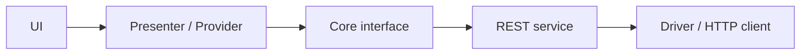

# Prompt: Create Spec

**Objective:** Write a technical specification for a feature, fix, or refactor in the Sertton project. The spec must bridge product intent and implementation details with enough clarity for direct execution or formal planning.

---

## Input

- **Task draft:** feature, fix, or refactor request
- **Relevant product context:** issue, discussion, bug report, or user request
- **Codebase access:** required for research and validation

Optional:

- **Bug report:** `documentation/features/{domain}/reports/{name}-bug-report.md`

If the request is too vague to define implementation safely, stop and ask for clarification before finalizing the spec.

---

## Project Context

This repository is a Flutter/Dart e-commerce app with layered architecture:

- `lib/core/`
- `lib/rest/`
- `lib/drivers/`
- `lib/ui/`

Important patterns to preserve:

- MVP in the UI layer
- Riverpod for dependency injection
- Signals for reactive state where already adopted
- Dio for HTTP access
- Yampi service implementations in the REST layer

Always align the spec with:

- `documentation/overview.md`
- `documentation/architecture.md`
- `documentation/rules/rules.md`

And with the layer-specific rule files referenced by `rules.md`.

---

## Non-Negotiable Principles

1. **Use real paths.** Every referenced file must exist in the repository or be explicitly marked as a new file.
2. **Do not invent architecture.** Follow existing Sertton patterns unless the request explicitly requires a structural change.
3. **Describe contracts, not implementation code.** The spec defines structure, responsibilities, and data flow, not final code bodies.
4. **Preserve layer boundaries.** UI must not call HTTP or infrastructure directly. Core must remain independent from framework and transport concerns.
5. **Prefer repository conventions over generic advice.** Use the project's actual naming, file organization, and responsibility split.
6. **Keep ambiguity explicit.** If something important cannot be inferred safely, ask before finishing the spec.
7. **Tests are referenced, not fully designed here.** Mention testing impact, but do not turn the spec into a test plan.

---

## Execution Process

### 1. Research the request

Read the request and summarize only the implementation-relevant part:

- desired behavior
- affected user flow
- constraints
- domain involved

### 2. Read project guidance

Read:

- `documentation/overview.md`
- `documentation/architecture.md`
- `documentation/rules/rules.md`

Then identify which layer rules are relevant for the requested change.

### 3. Research the codebase

Use the codebase to answer:

- Which files already implement similar behavior?
- Which domain module owns the feature?
- Which DTOs, services, presenters, widgets, or drivers are already related?
- What data flow already exists?
- What naming patterns should be preserved?

Use Serena for efficient repository search when helpful. Use Context7 only when library usage needs current documentation.

### 4. Synthesize the solution

Based on the request and the codebase:

- define what must be created
- define what must be modified
- define what, if anything, must be removed
- explain the layer-to-layer flow
- identify unresolved decisions that require user confirmation

### 5. Clarify high-impact ambiguity before writing

Ask the user before finalizing the spec when a decision has material impact, such as:

- changing layer ownership
- introducing a new dependency
- altering a public contract
- choosing between competing flows with product impact
- adding or avoiding persistence

Only leave an item in **Pending Items** if it intentionally remains open.

---

## Output File

Save the spec to:

- `documentation/features/{domain}/specs/{name}-spec.md`

---

## Required Document Structure

### Frontmatter

```md
---
title: <clear feature or fix title>
domain: <catalog|checkout|marketing|reviewing|shipping|global|institutional|other>
status: open
last_updated_at: <YYYY-MM-DD>
source: <issue, request, or bug report reference>
---
```

### 1. Objective

Describe what will be delivered from both product and technical perspectives in one short paragraph.

### 2. Scope

- **In scope:** what this spec covers
- **Out of scope:** what this spec explicitly does not cover

### 3. Functional Requirements

List only the requirements that affect implementation.

### 4. Non-Functional Requirements

Include only relevant and verifiable constraints, such as performance, resilience, state handling, accessibility, or validation behavior.

If none apply, write `Not applicable`.

### 5. Existing Implementation

Group by layer and reference real files.

Format:

- `**Name** ([path]) - short description`

Cover only what is relevant:

- `core`
- `rest`
- `drivers`
- `ui`

### 6. Files to Create

For each new file:

- **File:** path and mark as `(new file)`
- **Responsibility:** what it owns
- **Dependencies:** what it consumes
- **Key API or members:** Dart signatures with one-line responsibilities when helpful

Use repository-appropriate concepts such as:

- DTOs
- service interfaces
- Yampi service implementations
- mappers
- presenters
- widgets
- route entries
- providers
- drivers

### 7. Files to Modify

For each file:

- **File:** path
- **Change:** what must change
- **Reason:** why the change is needed

If none apply, write `Not applicable`.

### 8. Files to Remove

For each file:

- **File:** path
- **Reason:** why it should be removed
- **Impact:** what depends on it

If none apply, write `Not applicable`.

### 9. Technical Decisions

For each important decision include:

- decision
- alternatives considered
- rationale
- trade-offs

### 10. Data and Interaction Flow

Explain how data moves through the affected layers.

When useful, include a Mermaid diagram such as:



### 11. Validation Impact

Describe what kinds of validation will be needed during implementation:

- unit tests
- widget tests
- manual app flow validation
- service integration checks

Do not write the tests themselves.

### 12. Pending Items

List only unresolved items that remain open after clarification.

If there are none, write `No pending items`.

### 13. Recommended Execution Path

Choose one:

- `implement-spec`
- `create-plan` followed by `implement-plan`

Add a short justification based on scope, coupling, and execution complexity.
