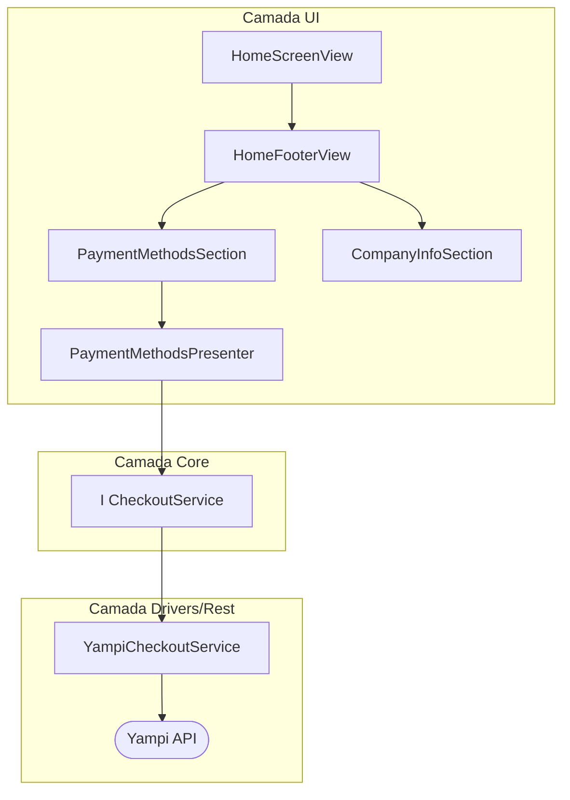

# Spec: Footer da tela home

## Objetivo

Implementar um footer na tela home que exiba as formas de pagamento disponíveis (obtidas via API), endereço e CNPJ da empresa Sertton (dados estáticos).

## Implementação Realizada

### Camada Core

- `lib/core/checkout/dtos/payment_dto.dart`: DTO de pagamentos.
- `lib/core/checkout/interfaces/checkout_service.dart`: Interface definindo `fetchPayments()`.

### Camada REST

- `lib/rest/yampi/services/yampi_checkout_service.dart`: Implementado método `fetchPayments` com mapeamento correto, retornando `RestResponse<List<PaymentDto>>`.
- `lib/rest/yampi/mappers/yampi_payment_mapper.dart`: Mapper utilizado para converter resposta da API.

### Camada UI

**Diretório:** `lib/ui/global/widgets/screens/home/footer-section/`

- **`home_footer_view.dart`**:
    - Widget principal do footer.
    - Estrutura: Container com padding, borda superior e cor de fundo sutil.
    - Compõe: `PaymentMethodsSection` e `CompanyInfoSection`.

- **`payment-methods-section/`** (Sub-feature):
    - **`payment_methods_section_view.dart`**: Widget que exibe os ícones de pagamento ou estado de loading.
    - **`payment_methods_section_presenter.dart`**: Controller (Signals) responsável por buscar os pagamentos via `CheckoutService` e filtrar `method == creditCard`.
    - **`widgets/payment_method_skeleton.dart`**: Componente de loading (esqueleto) exibido durante o fetch.

- **`company-info-section/`** (Sub-feature):
    - **`company_info_section_view.dart`**: Widget estático com informações da empresa (Separador, Endereço, Copyright, CNPJ).

- **`lib/ui/global/widgets/screens/home/home_screen_view.dart`**:
    - Integrado `HomeFooterView` ao final da scroll view principal.

## Fluxo de Dados

## Detalhes de Implementação

### Dados Estáticos
- **Endereço:** "Rua Tomatssu Iawasse 233 - Vila Nova Bonsucesso"
- **CNPJ:** "33.805.461/0001-90"
- **Empresa:** "Sertton Brasil Distribuidora Ltda"

### UX/UI
- **Estilo:** Fundo `muted` (0.2 alpha), borda superior `border`.
- **Loading:** Skeletons animados durante a carga dos ícones.
- **Erro:** Se falhar o carregamento, a seção de pagamentos lida graciosamente (oculta ou mostra erro discreto, dependendo da imp.).

